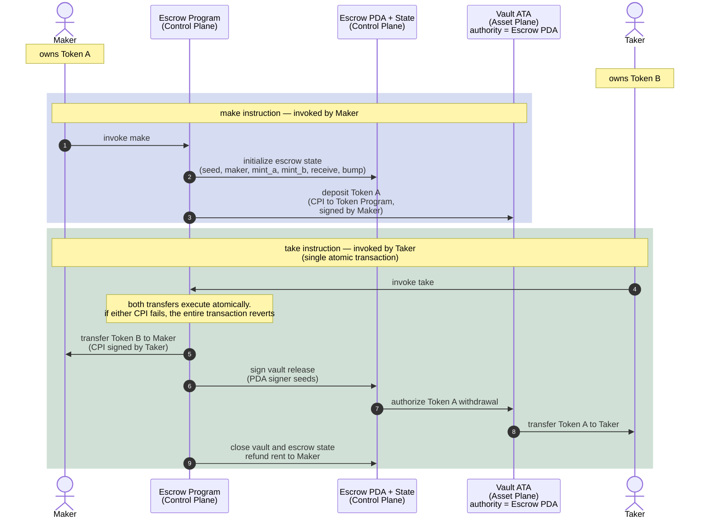

# Escrow: Trustless Token Exchange

A maker offers Token A in exchange for Token B.

The maker locks Token A into a vault controlled by the escrow PDA and
declares the amount of Token B they want in return.

A taker may later accept the trade by invoking `take`.

Inside a single atomic transaction:

1. Token B moves from the taker to the maker
2. Token A moves from the vault to the taker
3. The vault and escrow state are closed

If any step fails, the entire transaction reverts.

No escrow operator is trusted with custody. Atomic execution guarantees
that neither party can partially complete the exchange.

---

# Escrow State (PDA)

The escrow PDA acts as the control-plane authority for the exchange.

| Field     | Purpose                                       |
| --------- | --------------------------------------------- |
| `seed`    | Distingushes multiple escrows from one maker |
| `maker`   | Creator of the escrow                         |
| `mint_a`  | Token being offered                           |
| `mint_b`  | Token requested in return                     |
| `receive` | Amount of Token B expected                    |
| `bump`    | PDA bump seed                                 |

---

# Architecture Model

## Control Plane

Coordinates:

* instruction execution
* authority validation
* escrow lifecycle management
* PDA signing for vault operations

Components:

* Maker
* Taker
* Escrow Program
* Escrow PDA + Escrow State

The Escrow PDA acts as the escrow authority and signs CPI operations
using PDA signer seeds during the exchange.

The Escrow State stores the trade configuration:

* which assets are involved
* who created the escrow
* how much Token B is required
* which vault belongs to the escrow

## Asset Plane

Holds custody of the actual token balances.

Components:

* Vault ATA
* Maker token accounts
* Taker token accounts

The vault ATA temporarily escrows Token A.

Its authority is assigned to the Escrow PDA, allowing the escrow program
to authorize release of Token A only when the trade conditions are satisfied.

# Flow

