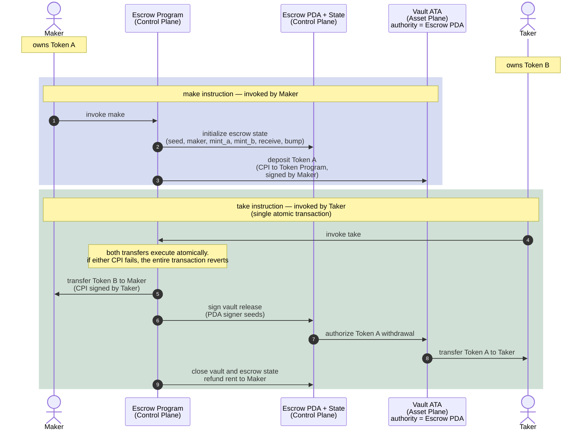

# Escrow: Trustless Token Exchange

A maker offers Token A in exchange for Token B.

The maker locks Token A into a vault controlled by the escrow PDA and
declares the amount of Token B they want in return.

A taker may later accept the trade by invoking `take`.

Inside a single atomic transaction:

1. Token B moves from the taker to the maker
2. Token A moves from the vault to the taker
3. The vault and escrow state are closed

If any step fails, the entire transaction reverts.

No escrow operator is trusted with custody. Atomic execution guarantees
that neither party can partially complete the exchange.

---

# Escrow State (PDA)

The escrow PDA acts as the control-plane authority for the exchange.

| Field     | Purpose                                       |
| --------- | --------------------------------------------- |
| `seed`    | Distingushes multiple escrows from one maker |
| `maker`   | Creator of the escrow                         |
| `mint_a`  | Token being offered                           |
| `mint_b`  | Token requested in return                     |
| `receive` | Amount of Token B expected                    |
| `bump`    | PDA bump seed                                 |

---

# Architecture Model

## Control Plane

Coordinates:

* instruction execution
* authority validation
* escrow lifecycle management
* PDA signing for vault operations

Components:

* Maker
* Taker
* Escrow Program
* Escrow PDA + Escrow State

The Escrow PDA acts as the escrow authority and signs CPI operations
using PDA signer seeds during the exchange.

The Escrow State stores the trade configuration:

* which assets are involved
* who created the escrow
* how much Token B is required
* which vault belongs to the escrow

## Asset Plane

Holds custody of the actual token balances.

Components:

* Vault ATA
* Maker token accounts
* Taker token accounts

The vault ATA temporarily escrows Token A.

Its authority is assigned to the Escrow PDA, allowing the escrow program
to authorize release of Token A only when the trade conditions are satisfied.

# Flow



## Example Run (with --nocapture)


running 1 test
test test_id ... ok

test result: ok. 1 passed; 0 failed; 0 ignored; 0 measured; 0 filtered out; finished in 0.00s


running 3 tests
test buildable_ix_resolves_correct_accounts_struct ... ok
test make_creates_escrow_and_funds_vault ... 

### make_creates_escrow_and_funds_vault


```console
=== Structured Transaction Logs ===
Instruction: instruction to 4iTshPQzLB9YstwVKJuHqd1UDMQpWRmE3NWeuNt7MrRt
Transaction
└── 4iTshPQzLB9YstwVKJuHqd1UDMQpWRmE3NWeuNt7MrRt [1] ✓ 44911cu
    ├── 11111111111111111111111111111111 [2] ✓
    ├── ATokenGPvbdGVxr1b2hvZbsiqW5xWH25efTNsLJA8knL [2] ✓ 18017cu
    │   ├── TokenkegQfeZyiNwAJbNbGKPFXCWuBvf9Ss623VQ5DA [3] ✓ 183cu
    │   ├── 11111111111111111111111111111111 [3] ✓
    │   ├── TokenkegQfeZyiNwAJbNbGKPFXCWuBvf9Ss623VQ5DA [3] ✓ 38cu
    │   └── TokenkegQfeZyiNwAJbNbGKPFXCWuBvf9Ss623VQ5DA [3] ✓ 235cu
    └── TokenkegQfeZyiNwAJbNbGKPFXCWuBvf9Ss623VQ5DA [2] ✓ 105cu
Compute Units: 44911
====================================

```

ok
test make_rejects_wrong_escrow_pda ... 

### make_rejects_wrong_escrow_pda


```console
=== Structured Transaction Logs ===
Instruction: instruction to 4iTshPQzLB9YstwVKJuHqd1UDMQpWRmE3NWeuNt7MrRt
Transaction
└── 4iTshPQzLB9YstwVKJuHqd1UDMQpWRmE3NWeuNt7MrRt [1] ✗ 7998cu
    └── Error: custom program error: 0x7d6
    ├──  AnchorError caused by account: escrow
         Error Code: ConstraintSeeds
         Error Number: 2006
         Error Message: A seeds constraint was violated.
    ├──  Left:
    ├──  111fcLTw6cc4kfAF9UhCriFQVbAMbL5WGR2Fn9G5eR
    ├──  Right:
    └──  47NyS3gGWv5rRqLjNrHqaZC95tE96yAL3ZqwYDP7baMD
Error: InstructionError(0, Custom(2006))
Compute Units: 7998
====================================

```

ok

test result: ok. 3 passed; 0 failed; 0 ignored; 0 measured; 0 filtered out; finished in 0.10s


running 3 tests
test refund_fails_before_expiry ... 

### refund_fails_before_expiry


```console
=== Structured Transaction Logs ===
Instruction: instruction to 4iTshPQzLB9YstwVKJuHqd1UDMQpWRmE3NWeuNt7MrRt
Transaction
└── 4iTshPQzLB9YstwVKJuHqd1UDMQpWRmE3NWeuNt7MrRt [1] ✗ 10360cu
    └── Error: custom program error: 0x1771
    └──  AnchorError caused by account: escrow
         Error Code: EscrowNotExpired
         Error Number: 6001
         Error Message: Escrow has not expired.
Error: InstructionError(0, Custom(6001))
Compute Units: 10360
====================================

```

ok
test refund_rejects_wrong_maker ... 

### refund_rejects_wrong_maker


```console
=== Structured Transaction Logs ===
Instruction: instruction to 4iTshPQzLB9YstwVKJuHqd1UDMQpWRmE3NWeuNt7MrRt
Transaction
└── 4iTshPQzLB9YstwVKJuHqd1UDMQpWRmE3NWeuNt7MrRt [1] ✗ 7552cu
    └── Error: custom program error: 0x7df
    ├──  AnchorError caused by account: maker_ata_a
         Error Code: ConstraintTokenOwner
         Error Number: 2015
         Error Message: A token owner constraint was violated.
    ├──  Left:
    ├──  CiaZxhERjVHHfj3RpmH7xdX7LQVHovqE4Fin8v9LMJpz
    ├──  Right:
    └──  11157t3sqMV725NVRLrVQbAu98Jjfk1uCKehJnXXQs
Error: InstructionError(0, Custom(2015))
Compute Units: 7552
====================================

```

ok
test refund_returns_deposit_and_closes_escrow ... 

### refund_returns_deposit_and_closes_escrow


```console
=== Structured Transaction Logs ===
Instruction: instruction to 4iTshPQzLB9YstwVKJuHqd1UDMQpWRmE3NWeuNt7MrRt
Transaction
└── 4iTshPQzLB9YstwVKJuHqd1UDMQpWRmE3NWeuNt7MrRt [1] ✓ 16605cu
    ├── TokenkegQfeZyiNwAJbNbGKPFXCWuBvf9Ss623VQ5DA [2] ✓ 105cu
    └── TokenkegQfeZyiNwAJbNbGKPFXCWuBvf9Ss623VQ5DA [2] ✓ 118cu
Compute Units: 16605
====================================

```

ok

test result: ok. 3 passed; 0 failed; 0 ignored; 0 measured; 0 filtered out; finished in 0.14s


running 3 tests
test take_and_close_fails_after_expiry ... 

### take_and_close_fails_after_expiry


```console
=== Structured Transaction Logs ===
Instruction: instruction to 4iTshPQzLB9YstwVKJuHqd1UDMQpWRmE3NWeuNt7MrRt
Transaction
└── 4iTshPQzLB9YstwVKJuHqd1UDMQpWRmE3NWeuNt7MrRt [1] ✗ 72272cu
    ├── Error: custom program error: 0x1770
    └──  AnchorError caused by account: escrow
         Error Code: EscrowExpired
         Error Number: 6000
         Error Message: Escrow has expired.
    ├── ATokenGPvbdGVxr1b2hvZbsiqW5xWH25efTNsLJA8knL [2] ✓ 14916cu
    │   ├── TokenkegQfeZyiNwAJbNbGKPFXCWuBvf9Ss623VQ5DA [3] ✓ 183cu
    │   ├── 11111111111111111111111111111111 [3] ✓
    │   ├── TokenkegQfeZyiNwAJbNbGKPFXCWuBvf9Ss623VQ5DA [3] ✓ 38cu
    │   ├── TokenkegQfeZyiNwAJbNbGKPFXCWuBvf9Ss623VQ5DA [3] ✓ 235cu
    └── ATokenGPvbdGVxr1b2hvZbsiqW5xWH25efTNsLJA8knL [2] ✓ 18017cu
        ├── TokenkegQfeZyiNwAJbNbGKPFXCWuBvf9Ss623VQ5DA [3] ✓ 183cu
        ├── 11111111111111111111111111111111 [3] ✓
        ├── TokenkegQfeZyiNwAJbNbGKPFXCWuBvf9Ss623VQ5DA [3] ✓ 38cu
        └── TokenkegQfeZyiNwAJbNbGKPFXCWuBvf9Ss623VQ5DA [3] ✓ 235cu
Error: InstructionError(0, Custom(6000))
Compute Units: 72272
====================================

```

ok
test take_and_close_succeeds_late_in_window ... 

### take_swaps_tokens_and_closes_vault


```console
=== Structured Transaction Logs ===
Instruction: instruction to 4iTshPQzLB9YstwVKJuHqd1UDMQpWRmE3NWeuNt7MrRt
Transaction
└── 4iTshPQzLB9YstwVKJuHqd1UDMQpWRmE3NWeuNt7MrRt [1] ✓ 74472cu
    ├── ATokenGPvbdGVxr1b2hvZbsiqW5xWH25efTNsLJA8knL [2] ✓ 14916cu
    │   ├── TokenkegQfeZyiNwAJbNbGKPFXCWuBvf9Ss623VQ5DA [3] ✓ 183cu
    │   ├── 11111111111111111111111111111111 [3] ✓
    │   ├── TokenkegQfeZyiNwAJbNbGKPFXCWuBvf9Ss623VQ5DA [3] ✓ 38cu
    │   ├── TokenkegQfeZyiNwAJbNbGKPFXCWuBvf9Ss623VQ5DA [3] ✓ 235cu
    ├── ATokenGPvbdGVxr1b2hvZbsiqW5xWH25efTNsLJA8knL [2] ✓ 15017cu
    │   ├── TokenkegQfeZyiNwAJbNbGKPFXCWuBvf9Ss623VQ5DA [3] ✓ 183cu
    │   ├── 11111111111111111111111111111111 [3] ✓
    │   ├── TokenkegQfeZyiNwAJbNbGKPFXCWuBvf9Ss623VQ5DA [3] ✓ 38cu
    │   └── TokenkegQfeZyiNwAJbNbGKPFXCWuBvf9Ss623VQ5DA [3] ✓ 235cu
    ├── TokenkegQfeZyiNwAJbNbGKPFXCWuBvf9Ss623VQ5DA [2] ✓ 105cu
    ├── TokenkegQfeZyiNwAJbNbGKPFXCWuBvf9Ss623VQ5DA [2] ✓ 105cu
    └── TokenkegQfeZyiNwAJbNbGKPFXCWuBvf9Ss623VQ5DA [2] ✓ 118cu
Compute Units: 74472
====================================

```

ok
test take_rejects_wrong_vault ... 

### take_rejects_wrong_vault


```console
=== Structured Transaction Logs ===
Instruction: instruction to 4iTshPQzLB9YstwVKJuHqd1UDMQpWRmE3NWeuNt7MrRt
Transaction
└── 4iTshPQzLB9YstwVKJuHqd1UDMQpWRmE3NWeuNt7MrRt [1] ✗ 7050cu
    └── Error: custom program error: 0xbc4
    └──  AnchorError caused by account: vault
         Error Code: AccountNotInitialized
         Error Number: 3012
         Error Message: The program expected this account to be already initialized.
Error: InstructionError(0, Custom(3012))
Compute Units: 7050
====================================

```

ok

test result: ok. 3 passed; 0 failed; 0 ignored; 0 measured; 0 filtered out; finished in 0.14s

