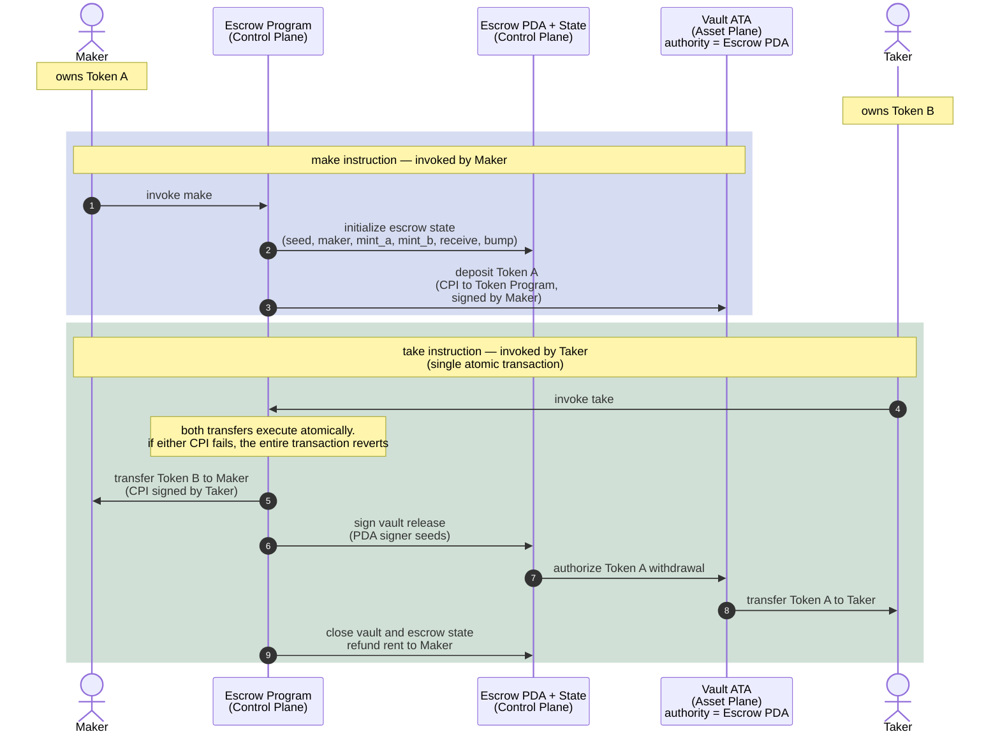

# Escrow: Trustless Token Exchange

A maker offers Token A in exchange for Token B.

The maker locks Token A into a vault controlled by the escrow PDA and
declares the amount of Token B they want in return.

A taker may later accept the trade by invoking `take`.

Inside a single atomic transaction:

1. Token B moves from the taker to the maker
2. Token A moves from the vault to the taker
3. The vault and escrow state are closed

If any step fails, the entire transaction reverts.

No escrow operator is trusted with custody. Atomic execution guarantees
that neither party can partially complete the exchange.

---

# Escrow State (PDA)

The escrow PDA acts as the control-plane authority for the exchange.

| Field     | Purpose                                       |
| --------- | --------------------------------------------- |
| `seed`    | Distingushes multiple escrows from one maker |
| `maker`   | Creator of the escrow                         |
| `mint_a`  | Token being offered                           |
| `mint_b`  | Token requested in return                     |
| `receive` | Amount of Token B expected                    |
| `bump`    | PDA bump seed                                 |

---

# Architecture Model

## Control Plane

Coordinates:

* instruction execution
* authority validation
* escrow lifecycle management
* PDA signing for vault operations

Components:

* Maker
* Taker
* Escrow Program
* Escrow PDA + Escrow State

The Escrow PDA acts as the escrow authority and signs CPI operations
using PDA signer seeds during the exchange.

The Escrow State stores the trade configuration:

* which assets are involved
* who created the escrow
* how much Token B is required
* which vault belongs to the escrow

## Asset Plane

Holds custody of the actual token balances.

Components:

* Vault ATA
* Maker token accounts
* Taker token accounts

The vault ATA temporarily escrows Token A.

Its authority is assigned to the Escrow PDA, allowing the escrow program
to authorize release of Token A only when the trade conditions are satisfied.

# Flow



## Example Run (with --no-capture)


running 1 test
test test_id ... ok

test result: ok. 1 passed; 0 failed; 0 ignored; 0 measured; 0 filtered out; finished in 0.00s


running 3 tests
test buildable_ix_resolves_correct_accounts_struct ... ok
### make_rejects_wrong_escrow_pda

<details><summary>Logs</summary>


```console
=== Transaction Logs ===
Instruction: instruction to H1GjRKWSauAuupurDtGiY5uvhLBtUngNhvrSBs75rH9o
Program H1GjRKWSauAuupurDtGiY5uvhLBtUngNhvrSBs75rH9o invoke [1]
Program log: Instruction: Make
Program log: AnchorError caused by account: escrow. Error Code: ConstraintSeeds. Error Number: 2006. Error Message: A seeds constraint was violated.
Program log: Left:
Program log: 111fcLTw6cc4kfAF9UhCriFQVbAMbL5WGR2Fn9G5eR
Program log: Right:
Program log: 5ry1HA36KUutvZqZQgkbXjiUACGqQAvD5xwodFDRYdH9
Program H1GjRKWSauAuupurDtGiY5uvhLBtUngNhvrSBs75rH9o consumed 7998 of 200000 compute units
Program H1GjRKWSauAuupurDtGiY5uvhLBtUngNhvrSBs75rH9o failed: custom program error: 0x7d6
Error: InstructionError(0, Custom(2006))
Compute Units: 7998
========================

```
</details>

```console
=== Structured Transaction Logs ===
Instruction: instruction to H1GjRKWSauAuupurDtGiY5uvhLBtUngNhvrSBs75rH9o
Transaction
└── H1GjRKWSauAuupurDtGiY5uvhLBtUngNhvrSBs75rH9o [1] ✗ 7998cu
    └── Error: custom program error: 0x7d6
    ├──  AnchorError caused by account: escrow
         Error Code: ConstraintSeeds
         Error Number: 2006
         Error Message: A seeds constraint was violated.
    ├──  Left:
    ├──  111fcLTw6cc4kfAF9UhCriFQVbAMbL5WGR2Fn9G5eR
    ├──  Right:
    └──  5ry1HA36KUutvZqZQgkbXjiUACGqQAvD5xwodFDRYdH9
Error: InstructionError(0, Custom(2006))
Compute Units: 7998
====================================

```
test make_rejects_wrong_escrow_pda ... ok
### make_creates_escrow_and_funds_vault

<details><summary>Logs</summary>


```console
=== Transaction Logs ===
Instruction: instruction to H1GjRKWSauAuupurDtGiY5uvhLBtUngNhvrSBs75rH9o
Program H1GjRKWSauAuupurDtGiY5uvhLBtUngNhvrSBs75rH9o invoke [1]
Program log: Instruction: Make
Program 11111111111111111111111111111111 invoke [2]
Program 11111111111111111111111111111111 success
Program ATokenGPvbdGVxr1b2hvZbsiqW5xWH25efTNsLJA8knL invoke [2]
Program log: Create
Program TokenkegQfeZyiNwAJbNbGKPFXCWuBvf9Ss623VQ5DA invoke [3]
Program TokenkegQfeZyiNwAJbNbGKPFXCWuBvf9Ss623VQ5DA consumed 183 of 181846 compute units
Program return: TokenkegQfeZyiNwAJbNbGKPFXCWuBvf9Ss623VQ5DA pQAAAAAAAAA=
Program TokenkegQfeZyiNwAJbNbGKPFXCWuBvf9Ss623VQ5DA success
Program 11111111111111111111111111111111 invoke [3]
Program 11111111111111111111111111111111 success
Program log: Initialize the associated token account
Program TokenkegQfeZyiNwAJbNbGKPFXCWuBvf9Ss623VQ5DA invoke [3]
Program TokenkegQfeZyiNwAJbNbGKPFXCWuBvf9Ss623VQ5DA consumed 38 of 176753 compute units
Program TokenkegQfeZyiNwAJbNbGKPFXCWuBvf9Ss623VQ5DA success
Program TokenkegQfeZyiNwAJbNbGKPFXCWuBvf9Ss623VQ5DA invoke [3]
Program TokenkegQfeZyiNwAJbNbGKPFXCWuBvf9Ss623VQ5DA consumed 235 of 174289 compute units
Program TokenkegQfeZyiNwAJbNbGKPFXCWuBvf9Ss623VQ5DA success
Program ATokenGPvbdGVxr1b2hvZbsiqW5xWH25efTNsLJA8knL consumed 13517 of 187267 compute units
Program ATokenGPvbdGVxr1b2hvZbsiqW5xWH25efTNsLJA8knL success
Program TokenkegQfeZyiNwAJbNbGKPFXCWuBvf9Ss623VQ5DA invoke [2]
Program TokenkegQfeZyiNwAJbNbGKPFXCWuBvf9Ss623VQ5DA consumed 105 of 165323 compute units
Program TokenkegQfeZyiNwAJbNbGKPFXCWuBvf9Ss623VQ5DA success
Program H1GjRKWSauAuupurDtGiY5uvhLBtUngNhvrSBs75rH9o consumed 35627 of 200000 compute units
Program H1GjRKWSauAuupurDtGiY5uvhLBtUngNhvrSBs75rH9o success
Compute Units: 35627
========================

```
</details>

```console
=== Structured Transaction Logs ===
Instruction: instruction to H1GjRKWSauAuupurDtGiY5uvhLBtUngNhvrSBs75rH9o
Transaction
└── H1GjRKWSauAuupurDtGiY5uvhLBtUngNhvrSBs75rH9o [1] ✓ 35627cu
    ├── 11111111111111111111111111111111 [2] ✓
    ├── ATokenGPvbdGVxr1b2hvZbsiqW5xWH25efTNsLJA8knL [2] ✓ 13517cu
    │   ├── TokenkegQfeZyiNwAJbNbGKPFXCWuBvf9Ss623VQ5DA [3] ✓ 183cu
    │   ├── 11111111111111111111111111111111 [3] ✓
    │   ├── TokenkegQfeZyiNwAJbNbGKPFXCWuBvf9Ss623VQ5DA [3] ✓ 38cu
    │   └── TokenkegQfeZyiNwAJbNbGKPFXCWuBvf9Ss623VQ5DA [3] ✓ 235cu
    └── TokenkegQfeZyiNwAJbNbGKPFXCWuBvf9Ss623VQ5DA [2] ✓ 105cu
Compute Units: 35627
====================================

```
test make_creates_escrow_and_funds_vault ... ok

test result: ok. 3 passed; 0 failed; 0 ignored; 0 measured; 0 filtered out; finished in 0.04s


running 2 tests
### refund_returns_deposit_and_closes_escrow

<details><summary>Logs</summary>


```console
=== Transaction Logs ===
Instruction: instruction to H1GjRKWSauAuupurDtGiY5uvhLBtUngNhvrSBs75rH9o
Program H1GjRKWSauAuupurDtGiY5uvhLBtUngNhvrSBs75rH9o invoke [1]
Program log: Instruction: Refund
Program TokenkegQfeZyiNwAJbNbGKPFXCWuBvf9Ss623VQ5DA invoke [2]
Program TokenkegQfeZyiNwAJbNbGKPFXCWuBvf9Ss623VQ5DA consumed 105 of 187618 compute units
Program TokenkegQfeZyiNwAJbNbGKPFXCWuBvf9Ss623VQ5DA success
Program TokenkegQfeZyiNwAJbNbGKPFXCWuBvf9Ss623VQ5DA invoke [2]
Program TokenkegQfeZyiNwAJbNbGKPFXCWuBvf9Ss623VQ5DA consumed 118 of 185783 compute units
Program TokenkegQfeZyiNwAJbNbGKPFXCWuBvf9Ss623VQ5DA success
Program H1GjRKWSauAuupurDtGiY5uvhLBtUngNhvrSBs75rH9o consumed 14913 of 200000 compute units
Program H1GjRKWSauAuupurDtGiY5uvhLBtUngNhvrSBs75rH9o success
Compute Units: 14913
========================

```
</details>

```console
=== Structured Transaction Logs ===
Instruction: instruction to H1GjRKWSauAuupurDtGiY5uvhLBtUngNhvrSBs75rH9o
Transaction
└── H1GjRKWSauAuupurDtGiY5uvhLBtUngNhvrSBs75rH9o [1] ✓ 14913cu
    ├── TokenkegQfeZyiNwAJbNbGKPFXCWuBvf9Ss623VQ5DA [2] ✓ 105cu
    └── TokenkegQfeZyiNwAJbNbGKPFXCWuBvf9Ss623VQ5DA [2] ✓ 118cu
Compute Units: 14913
====================================

```
### refund_rejects_wrong_maker

<details><summary>Logs</summary>


```console
=== Transaction Logs ===
Instruction: instruction to H1GjRKWSauAuupurDtGiY5uvhLBtUngNhvrSBs75rH9o
Program H1GjRKWSauAuupurDtGiY5uvhLBtUngNhvrSBs75rH9o invoke [1]
Program log: Instruction: Refund
Program log: AnchorError caused by account: maker_ata_a. Error Code: ConstraintTokenOwner. Error Number: 2015. Error Message: A token owner constraint was violated.
Program log: Left:
Program log: CwnRgrwPERFW3tWi3iHACVVueLrW4fNotnfPa7jocYMr
Program log: Right:
Program log: 11157t3sqMV725NVRLrVQbAu98Jjfk1uCKehJnXXQs
Program H1GjRKWSauAuupurDtGiY5uvhLBtUngNhvrSBs75rH9o consumed 7540 of 200000 compute units
Program H1GjRKWSauAuupurDtGiY5uvhLBtUngNhvrSBs75rH9o failed: custom program error: 0x7df
Error: InstructionError(0, Custom(2015))
Compute Units: 7540
========================

```
</details>

```console
=== Structured Transaction Logs ===
Instruction: instruction to H1GjRKWSauAuupurDtGiY5uvhLBtUngNhvrSBs75rH9o
test refund_returns_deposit_and_closes_escrow ... ok
Transaction
└── H1GjRKWSauAuupurDtGiY5uvhLBtUngNhvrSBs75rH9o [1] ✗ 7540cu
    └── Error: custom program error: 0x7df
    ├──  AnchorError caused by account: maker_ata_a
         Error Code: ConstraintTokenOwner
         Error Number: 2015
         Error Message: A token owner constraint was violated.
    ├──  Left:
    ├──  CwnRgrwPERFW3tWi3iHACVVueLrW4fNotnfPa7jocYMr
    ├──  Right:
    └──  11157t3sqMV725NVRLrVQbAu98Jjfk1uCKehJnXXQs
Error: InstructionError(0, Custom(2015))
Compute Units: 7540
====================================

```
test refund_rejects_wrong_maker ... ok

test result: ok. 2 passed; 0 failed; 0 ignored; 0 measured; 0 filtered out; finished in 0.04s


running 2 tests
### take_rejects_wrong_vault

<details><summary>Logs</summary>


```console
=== Transaction Logs ===
Instruction: instruction to H1GjRKWSauAuupurDtGiY5uvhLBtUngNhvrSBs75rH9o
Program H1GjRKWSauAuupurDtGiY5uvhLBtUngNhvrSBs75rH9o invoke [1]
Program log: Instruction: Take
Program log: AnchorError caused by account: vault. Error Code: AccountNotInitialized. Error Number: 3012. Error Message: The program expected this account to be already initialized.
Program H1GjRKWSauAuupurDtGiY5uvhLBtUngNhvrSBs75rH9o consumed 7038 of 200000 compute units
Program H1GjRKWSauAuupurDtGiY5uvhLBtUngNhvrSBs75rH9o failed: custom program error: 0xbc4
Error: InstructionError(0, Custom(3012))
Compute Units: 7038
========================

```
</details>

```console
=== Structured Transaction Logs ===
Instruction: instruction to H1GjRKWSauAuupurDtGiY5uvhLBtUngNhvrSBs75rH9o
Transaction
└── H1GjRKWSauAuupurDtGiY5uvhLBtUngNhvrSBs75rH9o [1] ✗ 7038cu
    └── Error: custom program error: 0xbc4
    └──  AnchorError caused by account: vault
         Error Code: AccountNotInitialized
         Error Number: 3012
         Error Message: The program expected this account to be already initialized.
Error: InstructionError(0, Custom(3012))
Compute Units: 7038
====================================

```
test take_rejects_wrong_vault ... ok
### take_swaps_tokens_and_closes_vault

<details><summary>Logs</summary>


```console
=== Transaction Logs ===
Instruction: instruction to H1GjRKWSauAuupurDtGiY5uvhLBtUngNhvrSBs75rH9o
Program H1GjRKWSauAuupurDtGiY5uvhLBtUngNhvrSBs75rH9o invoke [1]
Program log: Instruction: Take
Program ATokenGPvbdGVxr1b2hvZbsiqW5xWH25efTNsLJA8knL invoke [2]
Program log: Create
Program TokenkegQfeZyiNwAJbNbGKPFXCWuBvf9Ss623VQ5DA invoke [3]
Program TokenkegQfeZyiNwAJbNbGKPFXCWuBvf9Ss623VQ5DA consumed 183 of 185505 compute units
Program return: TokenkegQfeZyiNwAJbNbGKPFXCWuBvf9Ss623VQ5DA pQAAAAAAAAA=
Program TokenkegQfeZyiNwAJbNbGKPFXCWuBvf9Ss623VQ5DA success
Program 11111111111111111111111111111111 invoke [3]
Program 11111111111111111111111111111111 success
Program log: Initialize the associated token account
Program TokenkegQfeZyiNwAJbNbGKPFXCWuBvf9Ss623VQ5DA invoke [3]
Program TokenkegQfeZyiNwAJbNbGKPFXCWuBvf9Ss623VQ5DA consumed 38 of 180403 compute units
Program TokenkegQfeZyiNwAJbNbGKPFXCWuBvf9Ss623VQ5DA success
Program TokenkegQfeZyiNwAJbNbGKPFXCWuBvf9Ss623VQ5DA invoke [3]
Program TokenkegQfeZyiNwAJbNbGKPFXCWuBvf9Ss623VQ5DA consumed 235 of 177941 compute units
Program TokenkegQfeZyiNwAJbNbGKPFXCWuBvf9Ss623VQ5DA success
Program ATokenGPvbdGVxr1b2hvZbsiqW5xWH25efTNsLJA8knL consumed 13425 of 190848 compute units
Program ATokenGPvbdGVxr1b2hvZbsiqW5xWH25efTNsLJA8knL success
Program ATokenGPvbdGVxr1b2hvZbsiqW5xWH25efTNsLJA8knL invoke [2]
Program log: Create
Program TokenkegQfeZyiNwAJbNbGKPFXCWuBvf9Ss623VQ5DA invoke [3]
Program TokenkegQfeZyiNwAJbNbGKPFXCWuBvf9Ss623VQ5DA consumed 183 of 165660 compute units
Program return: TokenkegQfeZyiNwAJbNbGKPFXCWuBvf9Ss623VQ5DA pQAAAAAAAAA=
Program TokenkegQfeZyiNwAJbNbGKPFXCWuBvf9Ss623VQ5DA success
Program 11111111111111111111111111111111 invoke [3]
Program 11111111111111111111111111111111 success
Program log: Initialize the associated token account
Program TokenkegQfeZyiNwAJbNbGKPFXCWuBvf9Ss623VQ5DA invoke [3]
Program TokenkegQfeZyiNwAJbNbGKPFXCWuBvf9Ss623VQ5DA consumed 38 of 160567 compute units
Program TokenkegQfeZyiNwAJbNbGKPFXCWuBvf9Ss623VQ5DA success
Program TokenkegQfeZyiNwAJbNbGKPFXCWuBvf9Ss623VQ5DA invoke [3]
Program TokenkegQfeZyiNwAJbNbGKPFXCWuBvf9Ss623VQ5DA consumed 235 of 158103 compute units
Program TokenkegQfeZyiNwAJbNbGKPFXCWuBvf9Ss623VQ5DA success
Program ATokenGPvbdGVxr1b2hvZbsiqW5xWH25efTNsLJA8knL consumed 13517 of 171081 compute units
Program ATokenGPvbdGVxr1b2hvZbsiqW5xWH25efTNsLJA8knL success
Program TokenkegQfeZyiNwAJbNbGKPFXCWuBvf9Ss623VQ5DA invoke [2]
Program TokenkegQfeZyiNwAJbNbGKPFXCWuBvf9Ss623VQ5DA consumed 105 of 142498 compute units
Program TokenkegQfeZyiNwAJbNbGKPFXCWuBvf9Ss623VQ5DA success
Program TokenkegQfeZyiNwAJbNbGKPFXCWuBvf9Ss623VQ5DA invoke [2]
Program TokenkegQfeZyiNwAJbNbGKPFXCWuBvf9Ss623VQ5DA consumed 105 of 140462 compute units
Program TokenkegQfeZyiNwAJbNbGKPFXCWuBvf9Ss623VQ5DA success
Program TokenkegQfeZyiNwAJbNbGKPFXCWuBvf9Ss623VQ5DA invoke [2]
Program TokenkegQfeZyiNwAJbNbGKPFXCWuBvf9Ss623VQ5DA consumed 118 of 138624 compute units
Program TokenkegQfeZyiNwAJbNbGKPFXCWuBvf9Ss623VQ5DA success
Program H1GjRKWSauAuupurDtGiY5uvhLBtUngNhvrSBs75rH9o consumed 62290 of 200000 compute units
Program H1GjRKWSauAuupurDtGiY5uvhLBtUngNhvrSBs75rH9o success
Compute Units: 62290
========================

```
</details>

```console
=== Structured Transaction Logs ===
Instruction: instruction to H1GjRKWSauAuupurDtGiY5uvhLBtUngNhvrSBs75rH9o
Transaction
└── H1GjRKWSauAuupurDtGiY5uvhLBtUngNhvrSBs75rH9o [1] ✓ 62290cu
    ├── ATokenGPvbdGVxr1b2hvZbsiqW5xWH25efTNsLJA8knL [2] ✓ 13425cu
    │   ├── TokenkegQfeZyiNwAJbNbGKPFXCWuBvf9Ss623VQ5DA [3] ✓ 183cu
    │   ├── 11111111111111111111111111111111 [3] ✓
    │   ├── TokenkegQfeZyiNwAJbNbGKPFXCWuBvf9Ss623VQ5DA [3] ✓ 38cu
    │   ├── TokenkegQfeZyiNwAJbNbGKPFXCWuBvf9Ss623VQ5DA [3] ✓ 235cu
    ├── ATokenGPvbdGVxr1b2hvZbsiqW5xWH25efTNsLJA8knL [2] ✓ 13517cu
    │   ├── TokenkegQfeZyiNwAJbNbGKPFXCWuBvf9Ss623VQ5DA [3] ✓ 183cu
    │   ├── 11111111111111111111111111111111 [3] ✓
    │   ├── TokenkegQfeZyiNwAJbNbGKPFXCWuBvf9Ss623VQ5DA [3] ✓ 38cu
    │   └── TokenkegQfeZyiNwAJbNbGKPFXCWuBvf9Ss623VQ5DA [3] ✓ 235cu
    ├── TokenkegQfeZyiNwAJbNbGKPFXCWuBvf9Ss623VQ5DA [2] ✓ 105cu
    ├── TokenkegQfeZyiNwAJbNbGKPFXCWuBvf9Ss623VQ5DA [2] ✓ 105cu
    └── TokenkegQfeZyiNwAJbNbGKPFXCWuBvf9Ss623VQ5DA [2] ✓ 118cu
Compute Units: 62290
====================================

```
test take_swaps_tokens_and_closes_vault ... ok

test result: ok. 2 passed; 0 failed; 0 ignored; 0 measured; 0 filtered out; finished in 0.04s

