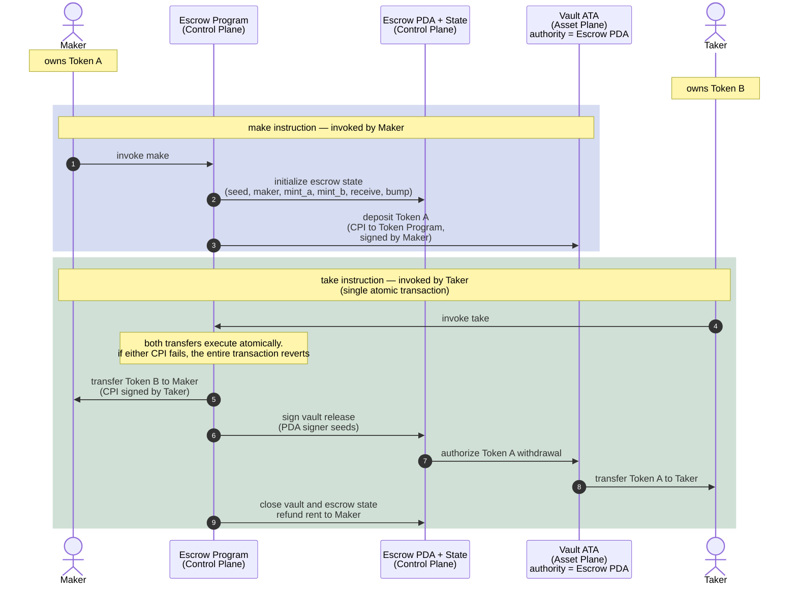

# Escrow: Trustless Token Exchange

A maker offers Token A in exchange for Token B.

The maker locks Token A into a vault controlled by the escrow PDA and
declares the amount of Token B they want in return.

A taker may later accept the trade by invoking `take`.

Inside a single atomic transaction:

1. Token B moves from the taker to the maker
2. Token A moves from the vault to the taker
3. The vault and escrow state are closed

If any step fails, the entire transaction reverts.

No escrow operator is trusted with custody. Atomic execution guarantees
that neither party can partially complete the exchange.

---

# Escrow State (PDA)

The escrow PDA acts as the control-plane authority for the exchange.

| Field     | Purpose                                       |
| --------- | --------------------------------------------- |
| `seed`    | Distingushes multiple escrows from one maker |
| `maker`   | Creator of the escrow                         |
| `mint_a`  | Token being offered                           |
| `mint_b`  | Token requested in return                     |
| `receive` | Amount of Token B expected                    |
| `bump`    | PDA bump seed                                 |

---

# Architecture Model

## Control Plane

Coordinates:

* instruction execution
* authority validation
* escrow lifecycle management
* PDA signing for vault operations

Components:

* Maker
* Taker
* Escrow Program
* Escrow PDA + Escrow State

The Escrow PDA acts as the escrow authority and signs CPI operations
using PDA signer seeds during the exchange.

The Escrow State stores the trade configuration:

* which assets are involved
* who created the escrow
* how much Token B is required
* which vault belongs to the escrow

## Asset Plane

Holds custody of the actual token balances.

Components:

* Vault ATA
* Maker token accounts
* Taker token accounts

The vault ATA temporarily escrows Token A.

Its authority is assigned to the Escrow PDA, allowing the escrow program
to authorize release of Token A only when the trade conditions are satisfied.

# Flow



## Example Run (with --no-capture)

```console
$ cargo tt
Compiling escrow v0.1.0 (/home/amal/sol/01-escrow/programs/escrow)
Finished `test` profile [unoptimized + debuginfo] target(s) in 2.65s
Running unittests src/lib.rs (target/debug/deps/escrow-cfe7480eee552646)

running 1 test
test test_id ... ok

test result: ok. 1 passed; 0 failed; 0 ignored; 0 measured; 0 filtered out; finished in 0.00s

Running tests/test_make.rs (target/debug/deps/test_make-0d3b90901450e0dc)

running 3 tests
test buildable_ix_resolves_correct_accounts_struct ... ok
=== Transaction Logs ===
Instruction: instruction to H1GjRKWSauAuupurDtGiY5uvhLBtUngNhvrSBs75rH9o
Program H1GjRKWSauAuupurDtGiY5uvhLBtUngNhvrSBs75rH9o invoke [1]
Program log: Instruction: Make
Program log: AnchorError caused by account: escrow. Error Code: ConstraintSeeds. Error Number: 2006. Error Message: A
seeds constraint was violated.
Program log: Left:
Program log: 111fcLTw6cc4kfAF9UhCriFQVbAMbL5WGR2Fn9G5eR
Program log: Right:
Program log: 54YwWVoPXSGXkhgW5p455vsU23NcuvBAiBoYfsRnCKkW
Program H1GjRKWSauAuupurDtGiY5uvhLBtUngNhvrSBs75rH9o consumed 9498 of 200000 compute units
Program H1GjRKWSauAuupurDtGiY5uvhLBtUngNhvrSBs75rH9o failed: custom program error: 0x7d6
Error: InstructionError(0, Custom(2006))
Compute Units: 9498
========================
test make_rejects_wrong_escrow_pda ... ok
=== Transaction Logs ===
Instruction: instruction to H1GjRKWSauAuupurDtGiY5uvhLBtUngNhvrSBs75rH9o
Program H1GjRKWSauAuupurDtGiY5uvhLBtUngNhvrSBs75rH9o invoke [1]
Program log: Instruction: Make
Program 11111111111111111111111111111111 invoke [2]
Program 11111111111111111111111111111111 success
Program ATokenGPvbdGVxr1b2hvZbsiqW5xWH25efTNsLJA8knL invoke [2]
Program log: Create
Program TokenkegQfeZyiNwAJbNbGKPFXCWuBvf9Ss623VQ5DA invoke [3]
Program TokenkegQfeZyiNwAJbNbGKPFXCWuBvf9Ss623VQ5DA consumed 183 of 175846 compute units
Program return: TokenkegQfeZyiNwAJbNbGKPFXCWuBvf9Ss623VQ5DA pQAAAAAAAAA=
Program TokenkegQfeZyiNwAJbNbGKPFXCWuBvf9Ss623VQ5DA success
Program 11111111111111111111111111111111 invoke [3]
Program 11111111111111111111111111111111 success
Program log: Initialize the associated token account
Program TokenkegQfeZyiNwAJbNbGKPFXCWuBvf9Ss623VQ5DA invoke [3]
Program TokenkegQfeZyiNwAJbNbGKPFXCWuBvf9Ss623VQ5DA consumed 38 of 170753 compute units
Program TokenkegQfeZyiNwAJbNbGKPFXCWuBvf9Ss623VQ5DA success
Program TokenkegQfeZyiNwAJbNbGKPFXCWuBvf9Ss623VQ5DA invoke [3]
Program TokenkegQfeZyiNwAJbNbGKPFXCWuBvf9Ss623VQ5DA consumed 235 of 168289 compute units
Program TokenkegQfeZyiNwAJbNbGKPFXCWuBvf9Ss623VQ5DA success
Program ATokenGPvbdGVxr1b2hvZbsiqW5xWH25efTNsLJA8knL consumed 15017 of 182767 compute units
Program ATokenGPvbdGVxr1b2hvZbsiqW5xWH25efTNsLJA8knL success
Program TokenkegQfeZyiNwAJbNbGKPFXCWuBvf9Ss623VQ5DA invoke [2]
Program TokenkegQfeZyiNwAJbNbGKPFXCWuBvf9Ss623VQ5DA consumed 105 of 162323 compute units
Program TokenkegQfeZyiNwAJbNbGKPFXCWuBvf9Ss623VQ5DA success
Program H1GjRKWSauAuupurDtGiY5uvhLBtUngNhvrSBs75rH9o consumed 38627 of 200000 compute units
Program H1GjRKWSauAuupurDtGiY5uvhLBtUngNhvrSBs75rH9o success
Compute Units: 38627
========================
test make_creates_escrow_and_funds_vault ... ok

test result: ok. 3 passed; 0 failed; 0 ignored; 0 measured; 0 filtered out; finished in 0.29s

Running tests/test_refund.rs (target/debug/deps/test_refund-46b5a30981c7844b)

running 2 tests
=== Transaction Logs ===
Instruction: instruction to H1GjRKWSauAuupurDtGiY5uvhLBtUngNhvrSBs75rH9o
Program H1GjRKWSauAuupurDtGiY5uvhLBtUngNhvrSBs75rH9o invoke [1]
Program log: Instruction: Refund
Program log: AnchorError caused by account: maker_ata_a. Error Code: ConstraintTokenOwner. Error Number: 2015. Error M
essage: A token owner constraint was violated.
Program log: Left:
Program log: 3jST49NgZvnwMjpiy2UWAxRdi1PYpNP6x2PgMSr8y14C
Program log: Right:
Program log: 11157t3sqMV725NVRLrVQbAu98Jjfk1uCKehJnXXQs
Program H1GjRKWSauAuupurDtGiY5uvhLBtUngNhvrSBs75rH9o consumed 7540 of 200000 compute units
Program H1GjRKWSauAuupurDtGiY5uvhLBtUngNhvrSBs75rH9o failed: custom program error: 0x7df
Error: InstructionError(0, Custom(2015))
Compute Units: 7540
========================
=== Transaction Logs ===
Instruction: instruction to H1GjRKWSauAuupurDtGiY5uvhLBtUngNhvrSBs75rH9o
Program H1GjRKWSauAuupurDtGiY5uvhLBtUngNhvrSBs75rH9o invoke [1]
Program log: Instruction: Refund
Program TokenkegQfeZyiNwAJbNbGKPFXCWuBvf9Ss623VQ5DA invoke [2]
Program TokenkegQfeZyiNwAJbNbGKPFXCWuBvf9Ss623VQ5DA consumed 105 of 184618 compute units
Program TokenkegQfeZyiNwAJbNbGKPFXCWuBvf9Ss623VQ5DA success
Program TokenkegQfeZyiNwAJbNbGKPFXCWuBvf9Ss623VQ5DA invoke [2]
Program TokenkegQfeZyiNwAJbNbGKPFXCWuBvf9Ss623VQ5DA consumed 118 of 182783 compute units
Program TokenkegQfeZyiNwAJbNbGKPFXCWuBvf9Ss623VQ5DA success
Program H1GjRKWSauAuupurDtGiY5uvhLBtUngNhvrSBs75rH9o consumed 17913 of 200000 compute units
Program H1GjRKWSauAuupurDtGiY5uvhLBtUngNhvrSBs75rH9o success
Compute Units: 17913
========================
test refund_rejects_wrong_maker ... ok
test refund_returns_deposit_and_closes_escrow ... ok

test result: ok. 2 passed; 0 failed; 0 ignored; 0 measured; 0 filtered out; finished in 0.30s

Running tests/test_take.rs (target/debug/deps/test_take-aa2320e8f2ff8273)

running 2 tests
=== Transaction Logs ===
Instruction: instruction to H1GjRKWSauAuupurDtGiY5uvhLBtUngNhvrSBs75rH9o
Program H1GjRKWSauAuupurDtGiY5uvhLBtUngNhvrSBs75rH9o invoke [1]
Program log: Instruction: Take
Program log: AnchorError caused by account: vault. Error Code: AccountNotInitialized. Error Number: 3012. Error Messag
e: The program expected this account to be already initialized.
Program H1GjRKWSauAuupurDtGiY5uvhLBtUngNhvrSBs75rH9o consumed 7038 of 200000 compute units
Program H1GjRKWSauAuupurDtGiY5uvhLBtUngNhvrSBs75rH9o failed: custom program error: 0xbc4
Error: InstructionError(0, Custom(3012))
Compute Units: 7038
========================
test take_rejects_wrong_vault ... ok
=== Transaction Logs ===
Instruction: instruction to H1GjRKWSauAuupurDtGiY5uvhLBtUngNhvrSBs75rH9o
Program H1GjRKWSauAuupurDtGiY5uvhLBtUngNhvrSBs75rH9o invoke [1]
Program log: Instruction: Take
Program ATokenGPvbdGVxr1b2hvZbsiqW5xWH25efTNsLJA8knL invoke [2]
Program log: Create
Program TokenkegQfeZyiNwAJbNbGKPFXCWuBvf9Ss623VQ5DA invoke [3]
Program TokenkegQfeZyiNwAJbNbGKPFXCWuBvf9Ss623VQ5DA consumed 183 of 176505 compute units
Program return: TokenkegQfeZyiNwAJbNbGKPFXCWuBvf9Ss623VQ5DA pQAAAAAAAAA=
Program TokenkegQfeZyiNwAJbNbGKPFXCWuBvf9Ss623VQ5DA success
Program 11111111111111111111111111111111 invoke [3]
Program 11111111111111111111111111111111 success
Program log: Initialize the associated token account
Program TokenkegQfeZyiNwAJbNbGKPFXCWuBvf9Ss623VQ5DA invoke [3]
Program TokenkegQfeZyiNwAJbNbGKPFXCWuBvf9Ss623VQ5DA consumed 38 of 171412 compute units
Program TokenkegQfeZyiNwAJbNbGKPFXCWuBvf9Ss623VQ5DA success
Program TokenkegQfeZyiNwAJbNbGKPFXCWuBvf9Ss623VQ5DA invoke [3]
Program TokenkegQfeZyiNwAJbNbGKPFXCWuBvf9Ss623VQ5DA consumed 235 of 168950 compute units
Program TokenkegQfeZyiNwAJbNbGKPFXCWuBvf9Ss623VQ5DA success
Program ATokenGPvbdGVxr1b2hvZbsiqW5xWH25efTNsLJA8knL consumed 17916 of 186348 compute units
Program ATokenGPvbdGVxr1b2hvZbsiqW5xWH25efTNsLJA8knL success
Program ATokenGPvbdGVxr1b2hvZbsiqW5xWH25efTNsLJA8knL invoke [2]
Program log: Create
Program TokenkegQfeZyiNwAJbNbGKPFXCWuBvf9Ss623VQ5DA invoke [3]
Program TokenkegQfeZyiNwAJbNbGKPFXCWuBvf9Ss623VQ5DA consumed 183 of 149169 compute units
Program return: TokenkegQfeZyiNwAJbNbGKPFXCWuBvf9Ss623VQ5DA pQAAAAAAAAA=
Program TokenkegQfeZyiNwAJbNbGKPFXCWuBvf9Ss623VQ5DA success
Program 11111111111111111111111111111111 invoke [3]
Program 11111111111111111111111111111111 success
Program log: Initialize the associated token account
Program TokenkegQfeZyiNwAJbNbGKPFXCWuBvf9Ss623VQ5DA invoke [3]
Program TokenkegQfeZyiNwAJbNbGKPFXCWuBvf9Ss623VQ5DA consumed 38 of 144076 compute units
Program TokenkegQfeZyiNwAJbNbGKPFXCWuBvf9Ss623VQ5DA success
Program TokenkegQfeZyiNwAJbNbGKPFXCWuBvf9Ss623VQ5DA invoke [3]
Program TokenkegQfeZyiNwAJbNbGKPFXCWuBvf9Ss623VQ5DA consumed 235 of 141612 compute units
Program TokenkegQfeZyiNwAJbNbGKPFXCWuBvf9Ss623VQ5DA success
Program ATokenGPvbdGVxr1b2hvZbsiqW5xWH25efTNsLJA8knL consumed 15017 of 156090 compute units
Program ATokenGPvbdGVxr1b2hvZbsiqW5xWH25efTNsLJA8knL success
Program TokenkegQfeZyiNwAJbNbGKPFXCWuBvf9Ss623VQ5DA invoke [2]
Program TokenkegQfeZyiNwAJbNbGKPFXCWuBvf9Ss623VQ5DA consumed 105 of 117007 compute units
Program TokenkegQfeZyiNwAJbNbGKPFXCWuBvf9Ss623VQ5DA success
Program TokenkegQfeZyiNwAJbNbGKPFXCWuBvf9Ss623VQ5DA invoke [2]
Program TokenkegQfeZyiNwAJbNbGKPFXCWuBvf9Ss623VQ5DA consumed 105 of 114971 compute units
Program TokenkegQfeZyiNwAJbNbGKPFXCWuBvf9Ss623VQ5DA success
Program TokenkegQfeZyiNwAJbNbGKPFXCWuBvf9Ss623VQ5DA invoke [2]
Program TokenkegQfeZyiNwAJbNbGKPFXCWuBvf9Ss623VQ5DA consumed 118 of 113133 compute units
Program TokenkegQfeZyiNwAJbNbGKPFXCWuBvf9Ss623VQ5DA success
Program H1GjRKWSauAuupurDtGiY5uvhLBtUngNhvrSBs75rH9o consumed 87781 of 200000 compute units
Program H1GjRKWSauAuupurDtGiY5uvhLBtUngNhvrSBs75rH9o success
Compute Units: 87781
========================
test take_swaps_tokens_and_closes_vault ... ok

test result: ok. 2 passed; 0 failed; 0 ignored; 0 measured; 0 filtered out; finished in 0.30s
```
